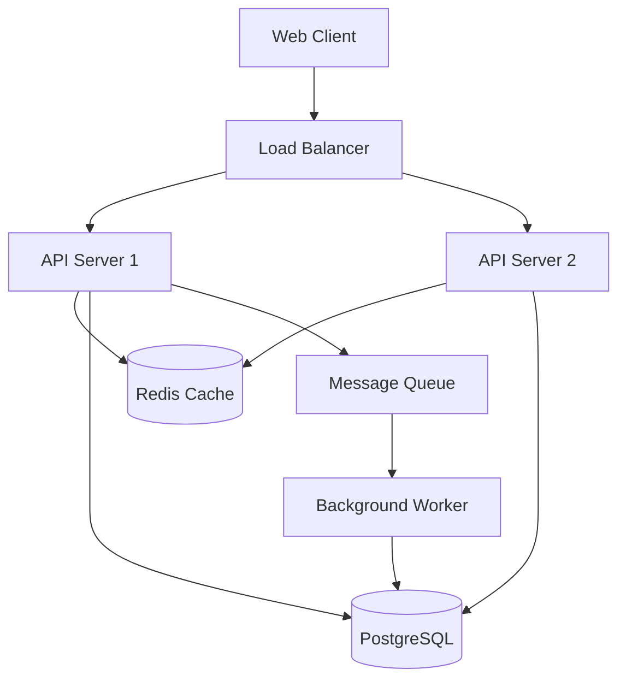
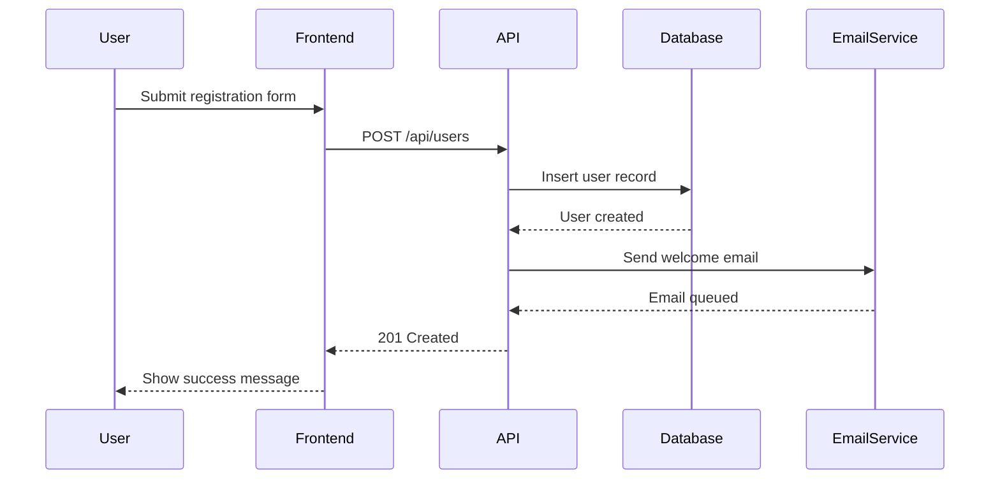
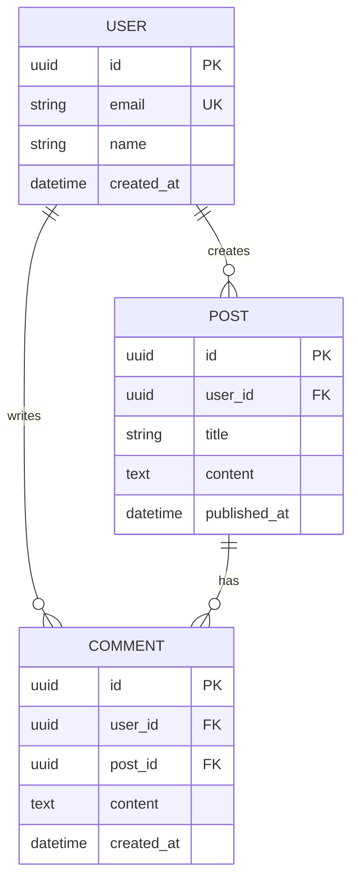
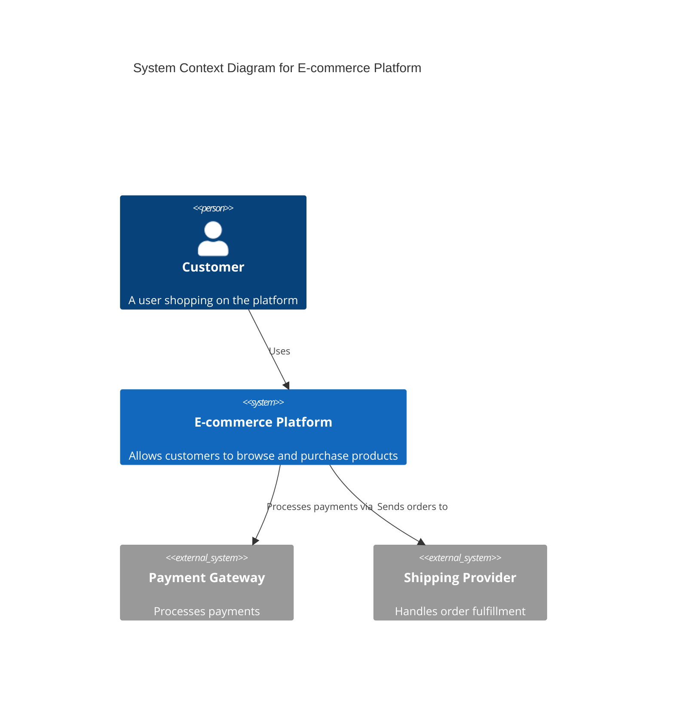

# Documentation

## Overview

Effective documentation is critical for team collaboration, knowledge sharing, and long-term project maintainability. This guide covers tools and practices for creating, maintaining, and organizing documentation across different contexts.

## Documentation Philosophy

### Core Principles

**1. Documentation as Code**
- Store documentation in version control
- Review documentation changes like code
- Automate documentation generation where possible
- Keep documentation close to the code it describes

**2. Write for Your Audience**
- Technical documentation for developers
- User guides for end users
- API documentation for integrators
- Architecture docs for stakeholders

**3. Keep It Current**
- Update docs with code changes
- Regular review cycles
- Archive outdated content
- Use automation to reduce staleness

**4. Make It Discoverable**
- Clear navigation structure
- Search functionality
- Cross-linking between docs
- Single source of truth

## Documentation Tools

### GitBook

**Why We Use It:**
- Beautiful, modern interface
- Git-backed content
- Markdown support
- Search functionality
- Version control
- Public and private spaces

**Structure Example:**
```
docs/
├── README.md (Introduction)
├── SUMMARY.md (Table of contents)
├── getting-started/
│   ├── installation.md
│   ├── quick-start.md
│   └── configuration.md
├── guides/
│   ├── user-guide.md
│   └── admin-guide.md
├── api/
│   └── api-reference.md
└── architecture/
    ├── overview.md
    └── decisions/
        ├── 001-use-postgres.md
        └── 002-event-driven.md
```

**SUMMARY.md Example:**
```markdown
# Table of contents

* [Introduction](README.md)

## Getting Started

* [Installation](getting-started/installation.md)
* [Quick Start](getting-started/quick-start.md)
* [Configuration](getting-started/configuration.md)

## Guides

* [User Guide](guides/user-guide.md)
* [Admin Guide](guides/admin-guide.md)

## API

* [API Reference](api/api-reference.md)

## Architecture

* [Overview](architecture/overview.md)
* [Architecture Decisions](architecture/decisions/README.md)
```

**Best Practices:**
- Use clear, hierarchical structure
- Include code examples
- Add images and diagrams
- Enable Git sync
- Set up custom domain
- Use spaces for different audiences

### Confluence

**When to Use:**
- Enterprise wiki needs
- Integration with Jira
- Rich collaboration features
- Template-based documentation

**Features:**
- Page trees and hierarchy
- Rich text editing
- Comments and mentions
- Page templates
- Permissions and spaces
- Integration with Atlassian tools

**Organization Strategy:**
```
Space: Engineering
├── Projects
│   ├── Project Alpha
│   │   ├── Overview
│   │   ├── Architecture
│   │   └── API Documentation
│   └── Project Beta
├── Team Processes
│   ├── Development Workflow
│   ├── Code Review Guidelines
│   └── Release Process
└── Runbooks
    ├── Deployment
    └── Incident Response
```

**Best Practices:**
- Use templates for consistency
- Set up space permissions
- Archive old content
- Use labels for organization
- Enable notifications
- Regular cleanup sprints

### MkDocs

**Why Consider It:**
- Python-based static site generator
- Markdown files
- Themes (Material for MkDocs is excellent)
- Plugin ecosystem
- Easy deployment

**Setup:**
```yaml
# mkdocs.yml
site_name: My Project Documentation
theme:
  name: material
  features:
    - navigation.tabs
    - navigation.sections
    - search.highlight
    - content.code.annotate

nav:
  - Home: index.md
  - Getting Started:
    - Installation: getting-started/installation.md
    - Quick Start: getting-started/quickstart.md
  - User Guide: guide.md
  - API Reference: api.md

plugins:
  - search
  - awesome-pages
  - git-revision-date-localized

markdown_extensions:
  - pymdownx.highlight
  - pymdownx.superfences
  - admonition
  - codehilite
```

**Deployment:**
```bash
# Build static site
mkdocs build

# Serve locally
mkdocs serve

# Deploy to GitHub Pages
mkdocs gh-deploy
```

### Docusaurus

**Why Consider It:**
- React-based
- Modern, fast websites
- Versioning support
- i18n (internationalization)
- MDX support (Markdown + JSX)

**Configuration:**
```javascript
// docusaurus.config.js
module.exports = {
  title: 'My Project',
  tagline: 'Documentation that scales',
  url: 'https://docs.example.com',
  baseUrl: '/',
  
  themeConfig: {
    navbar: {
      title: 'My Project',
      items: [
        {to: 'docs/intro', label: 'Docs', position: 'left'},
        {to: 'blog', label: 'Blog', position: 'left'},
        {
          href: 'https://github.com/org/repo',
          label: 'GitHub',
          position: 'right',
        },
      ],
    },
    footer: {
      style: 'dark',
      links: [
        {
          title: 'Docs',
          items: [
            {label: 'Getting Started', to: 'docs/intro'},
            {label: 'API', to: 'docs/api'},
          ],
        },
      ],
    },
  },
  
  presets: [
    [
      '@docusaurus/preset-classic',
      {
        docs: {
          sidebarPath: require.resolve('./sidebars.js'),
        },
        blog: {
          showReadingTime: true,
        },
        theme: {
          customCss: require.resolve('./src/css/custom.css'),
        },
      },
    ],
  ],
};
```

### Notion

**When to Use:**
- Flexible knowledge base
- Team collaboration
- Project management + docs
- Internal wikis

**Features:**
- Blocks-based editing
- Databases and tables
- Embedding and integration
- Templates
- Real-time collaboration

**Use Cases:**
- Team handbooks
- Meeting notes
- Project planning
- Design docs
- Personal knowledge management

## API Documentation

### OpenAPI/Swagger

**OpenAPI Specification (OAS):**

**Example:**
```yaml
openapi: 3.0.0
info:
  title: User API
  description: API for managing users
  version: 1.0.0
  contact:
    email: api@example.com

servers:
  - url: https://api.example.com/v1
    description: Production server
  - url: https://staging-api.example.com/v1
    description: Staging server

paths:
  /users:
    get:
      summary: List all users
      description: Returns a list of all users
      parameters:
        - name: limit
          in: query
          description: Maximum number of users to return
          required: false
          schema:
            type: integer
            minimum: 1
            maximum: 100
            default: 20
      responses:
        '200':
          description: Successful response
          content:
            application/json:
              schema:
                type: array
                items:
                  $ref: '#/components/schemas/User'
        '400':
          description: Bad request
        '500':
          description: Internal server error
    
    post:
      summary: Create a new user
      requestBody:
        required: true
        content:
          application/json:
            schema:
              $ref: '#/components/schemas/NewUser'
      responses:
        '201':
          description: User created
          content:
            application/json:
              schema:
                $ref: '#/components/schemas/User'

  /users/{userId}:
    get:
      summary: Get user by ID
      parameters:
        - name: userId
          in: path
          required: true
          schema:
            type: string
      responses:
        '200':
          description: Successful response
          content:
            application/json:
              schema:
                $ref: '#/components/schemas/User'
        '404':
          description: User not found

components:
  schemas:
    User:
      type: object
      properties:
        id:
          type: string
          format: uuid
        email:
          type: string
          format: email
        name:
          type: string
        createdAt:
          type: string
          format: date-time
      required:
        - id
        - email
        - name
    
    NewUser:
      type: object
      properties:
        email:
          type: string
          format: email
        name:
          type: string
        password:
          type: string
          format: password
      required:
        - email
        - name
        - password

  securitySchemes:
    bearerAuth:
      type: http
      scheme: bearer
      bearerFormat: JWT

security:
  - bearerAuth: []
```

**Tools:**
- **Swagger UI**: Interactive API documentation
- **Redoc**: Beautiful API documentation
- **Stoplight**: API design platform
- **Postman**: Generate from collections

**Code Generation:**
```bash
# Generate server stub
openapi-generator generate -i api.yaml -g nodejs-express-server

# Generate client SDK
openapi-generator generate -i api.yaml -g typescript-axios
```

**Best Practices:**
- Version your API spec
- Include examples
- Document error responses
- Use $ref for reusability
- Add descriptions and summaries
- Include authentication details
- Provide sample requests/responses

### GraphQL Documentation

**GraphQL Introspection:**

GraphQL APIs are self-documenting through introspection.

**Tools:**
- **GraphQL Playground**: Interactive GraphQL IDE
- **GraphiQL**: In-browser GraphQL IDE
- **Apollo Studio**: GraphQL platform

**Schema Documentation:**
```graphql
"""
User type representing a user in the system
"""
type User {
  """
  Unique identifier for the user
  """
  id: ID!
  
  """
  User's email address
  """
  email: String!
  
  """
  User's display name
  """
  name: String!
  
  """
  Posts created by this user
  """
  posts: [Post!]!
}

"""
Create a new user
"""
type Mutation {
  """
  Creates a new user account
  """
  createUser(
    """
    User's email address
    """
    email: String!
    
    """
    User's display name
    """
    name: String!
  ): User!
}
```

### API Documentation Generators

**Language-Specific:**

**JSDoc (JavaScript):**
```javascript
/**
 * Get a user by ID
 * @param {string} userId - The user's unique identifier
 * @returns {Promise<User>} The user object
 * @throws {NotFoundError} When user doesn't exist
 */
async function getUser(userId) {
  // Implementation
}
```

**Sphinx (Python):**
```python
def get_user(user_id: str) -> User:
    """
    Get a user by ID.
    
    Args:
        user_id (str): The user's unique identifier
        
    Returns:
        User: The user object
        
    Raises:
        NotFoundError: When user doesn't exist
        
    Example:
        >>> user = get_user("123")
        >>> print(user.name)
        'John Doe'
    """
    pass
```

**JavaDoc (Java):**
```java
/**
 * Get a user by ID
 * 
 * @param userId The user's unique identifier
 * @return The user object
 * @throws NotFoundException When user doesn't exist
 */
public User getUser(String userId) throws NotFoundException {
    // Implementation
}
```

## Architecture Documentation

### Architecture Diagrams

**Mermaid (Text-based Diagrams)**

**Why We Use It:**
- Text-based (version controllable)
- Rendered in Markdown
- Supports multiple diagram types
- No external tools needed

**System Architecture:**


**Sequence Diagram:**


**Entity Relationship:**


**C4 Model Diagrams:**


**Draw.io / Diagrams.net**

**When to Use:**
- Complex visual diagrams
- Need drag-and-drop interface
- Collaborate on diagrams
- Integration with Confluence

**Features:**
- Cloud and desktop versions
- Large shape library
- Export to multiple formats
- Version control integration

**Best Practices:**
- Save as .drawio.svg for version control
- Use layers for complexity
- Maintain consistent styling
- Include legends
- Keep diagrams focused

**Lucidchart**

**When to Use:**
- Team collaboration on diagrams
- Need professional templates
- Integration requirements
- Real-time collaboration

### Architecture Decision Records (ADRs)

**Format:**
```markdown
# ADR-001: Use PostgreSQL for Primary Database

## Status
Accepted

## Context
We need a reliable, scalable database for our application that supports:
- Complex queries and transactions
- JSON data storage
- Full-text search
- Strong consistency

We evaluated PostgreSQL, MySQL, and MongoDB.

## Decision
We will use PostgreSQL as our primary database.

## Consequences

### Positive
- ACID compliance ensures data integrity
- Native JSON support for flexible schemas
- Excellent performance for complex queries
- Strong ecosystem and community support
- Battle-tested in production environments

### Negative
- Requires vertical scaling (though horizontal is possible)
- More complex setup than NoSQL alternatives
- Need for connection pooling at scale

### Neutral
- Team needs to learn PostgreSQL-specific features
- Requires proper indexing strategy

## Alternatives Considered

### MySQL
- Pros: Widely known, good performance
- Cons: Weaker JSON support, less feature-rich

### MongoDB
- Pros: Flexible schema, horizontal scaling
- Cons: Eventually consistent, less mature transactions

## Notes
- Review this decision in 12 months
- Monitor query performance and scaling needs
- Consider read replicas for scaling reads
```

**Location:** `/docs/architecture/decisions/`

**Naming:** `ADR-XXX-short-title.md`

**Best Practices:**
- Keep ADRs immutable (don't edit, supersede)
- Write when decision is made
- Include team in review
- Link related ADRs
- Update index/TOC

### System Documentation

**README Template:**
```markdown
# Project Name

Brief description of what this project does.

## Quick Start

```bash
# Clone repository
git clone https://github.com/org/project.git

# Install dependencies
npm install

# Run locally
npm run dev
```

## Architecture

[Link to architecture docs]

## Development

### Prerequisites
- Node.js 18+
- PostgreSQL 15+
- Redis 7+

### Setup
1. Copy `.env.example` to `.env`
2. Update configuration
3. Run migrations: `npm run migrate`
4. Seed data: `npm run seed`

### Testing
```bash
npm test              # Run all tests
npm run test:unit     # Unit tests only
npm run test:e2e      # E2E tests only
```

### Deployment

See [DEPLOYMENT.md](DEPLOYMENT.md)

## Contributing

See [CONTRIBUTING.md](CONTRIBUTING.md)

## License

MIT License - see [LICENSE](LICENSE)
```

## Code Documentation

### Inline Comments

**When to Comment:**
- Complex algorithms
- Non-obvious business logic
- Workarounds or hacks
- TODOs and FIXMEs

**When NOT to Comment:**
- Obvious code
- Redundant information
- Outdated information

**Good Comments:**
```javascript
// Calculate price with volume discount
// 10-99 units: 5% off
// 100-999 units: 10% off
// 1000+ units: 15% off
function calculatePrice(quantity, unitPrice) {
  let discount = 0;
  if (quantity >= 1000) discount = 0.15;
  else if (quantity >= 100) discount = 0.10;
  else if (quantity >= 10) discount = 0.05;
  
  return quantity * unitPrice * (1 - discount);
}

// TODO: Implement retry logic for API failures
// FIXME: Race condition possible when multiple users update same record
// HACK: Workaround for library bug - remove when fixed in v2.1
```

### README Files

**Repository Root README:**
- Project overview
- Quick start
- Documentation links
- Contribution guidelines
- License

**Package/Module README:**
- Purpose and scope
- Installation
- Usage examples
- API reference
- Configuration

### Changelog

**Keep a Changelog Format:**
```markdown
# Changelog

All notable changes to this project will be documented in this file.

The format is based on [Keep a Changelog](https://keepachangelog.com/),
and this project adheres to [Semantic Versioning](https://semver.org/).

## [Unreleased]

### Added
- New feature X

### Changed
- Updated dependency Y

## [1.2.0] - 2024-01-15

### Added
- User authentication with JWT
- Password reset functionality
- Email notifications

### Changed
- Improved error handling
- Updated API response format

### Fixed
- Bug in user registration flow
- Memory leak in background worker

### Security
- Fixed SQL injection vulnerability in search

## [1.1.0] - 2023-12-01

[Previous versions...]
```

## Knowledge Base Management

### Internal Wiki

**Structure:**
```
wiki/
├── onboarding/
│   ├── new-developer.md
│   ├── access-checklist.md
│   └── tools-setup.md
├── processes/
│   ├── code-review.md
│   ├── deployment.md
│   └── incident-response.md
├── runbooks/
│   ├── database-migration.md
│   ├── scaling-infrastructure.md
│   └── troubleshooting.md
└── team/
    ├── team-charter.md
    ├── meeting-notes/
    └── retrospectives/
```

### Runbooks

**Template:**
```markdown
# Runbook: [Procedure Name]

## Overview
Brief description of when and why to use this runbook.

## Prerequisites
- Access to production environment
- VPN connection established
- PagerDuty access

## Steps

### 1. Assess the Situation
- Check monitoring dashboards: [Link]
- Review recent deployments: [Link]
- Check error logs: [Command]

### 2. Identify the Issue
**Symptoms:** List common symptoms
**Likely Causes:** Common root causes

### 3. Mitigation
```bash
# Step-by-step commands
kubectl get pods -n production
kubectl logs <pod-name>
```

### 4. Resolution
Detailed steps to fully resolve

### 5. Verification
- Confirm metrics returned to normal
- Check error rates
- Verify user impact resolved

## Rollback Procedure
If changes need to be reverted:
[Rollback steps]

## Post-Incident
- File incident report
- Update monitoring alerts
- Schedule post-mortem

## Related
- [Link to related runbooks]
- [Link to architecture docs]
- [Link to monitoring dashboard]

## History
- 2024-01-15: Created by @username
- 2024-02-01: Updated by @username
```

### Documentation Reviews

**Review Checklist:**
- [ ] Accuracy: Is information correct?
- [ ] Completeness: Are all steps included?
- [ ] Clarity: Is it easy to understand?
- [ ] Currency: Is it up-to-date?
- [ ] Accessibility: Can target audience find it?
- [ ] Examples: Are there enough examples?
- [ ] Links: Do all links work?

**Schedule:**
- Quarterly reviews for critical docs
- Annual reviews for stable docs
- Review on major changes
- Archive outdated content

## Documentation Best Practices

### Writing Style

**Be Clear and Concise:**
- Use simple language
- Short sentences and paragraphs
- Active voice
- Consistent terminology

**Structure Information:**
- Use headings and subheadings
- Bullet points and numbered lists
- Tables for comparisons
- Code blocks with syntax highlighting

**Include Examples:**
- Real-world scenarios
- Working code samples
- Screenshots when helpful
- Expected outputs

### Maintenance

**Version Control:**
- Track all documentation in Git
- Review docs in pull requests
- Link docs to related code
- Tag docs with releases

**Keep Current:**
- Update docs with code changes
- Archive deprecated information
- Note "last updated" dates
- Automate where possible

**Gather Feedback:**
- Add "Was this helpful?" surveys
- Monitor documentation usage
- Accept contributions
- Act on feedback

### Accessibility

**Make Documentation Accessible:**
- Semantic HTML structure
- Alt text for images
- Keyboard navigation
- Screen reader friendly
- Color contrast compliance
- Readable fonts and sizes

## Tools Comparison

| Tool | Best For | Pros | Cons |
|------|----------|------|------|
| GitBook | Product docs | Beautiful UI, Git sync | Cost for teams |
| Confluence | Enterprise wiki | Rich features, Jira integration | Can get messy |
| MkDocs | Technical docs | Simple, fast, customizable | Basic features |
| Docusaurus | Project sites | Modern, React-based | Heavier setup |
| Notion | Team wiki | Flexible, collaborative | Limited export |
| Swagger | API docs | Interactive, standard | API-focused only |

---

**Related:**
- [Development Tools](dev-tools.md) - Documentation tools in development
- [Monitoring](monitoring.md) - Runbook documentation
- [Infrastructure](infrastructure.md) - Infrastructure documentation
